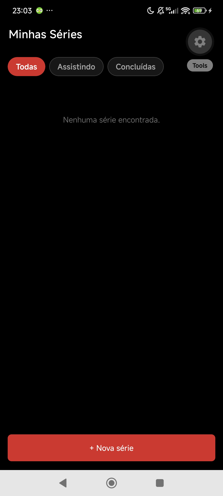
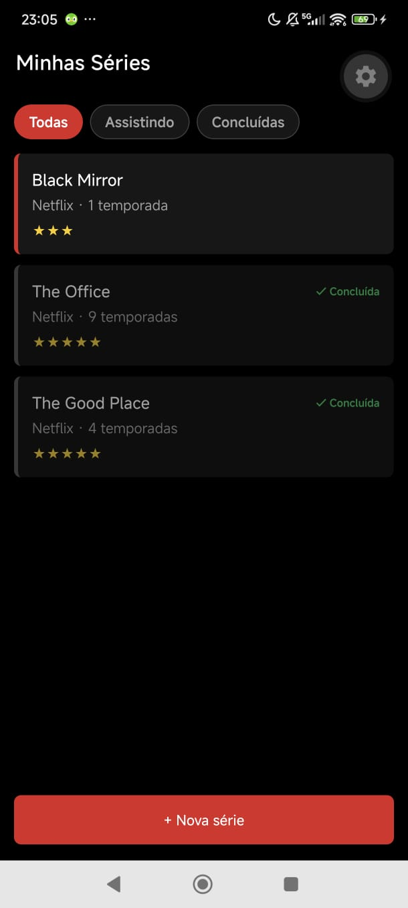
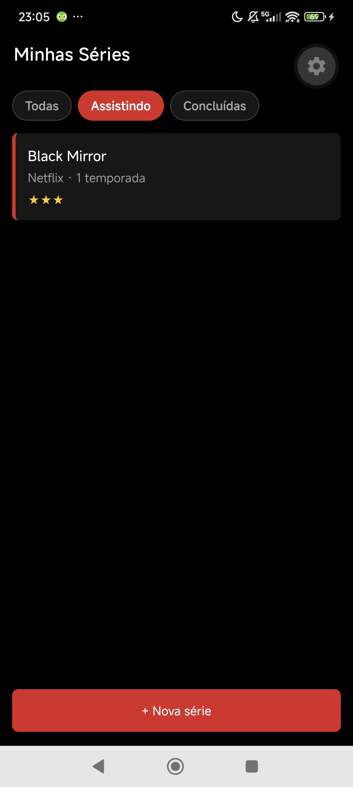
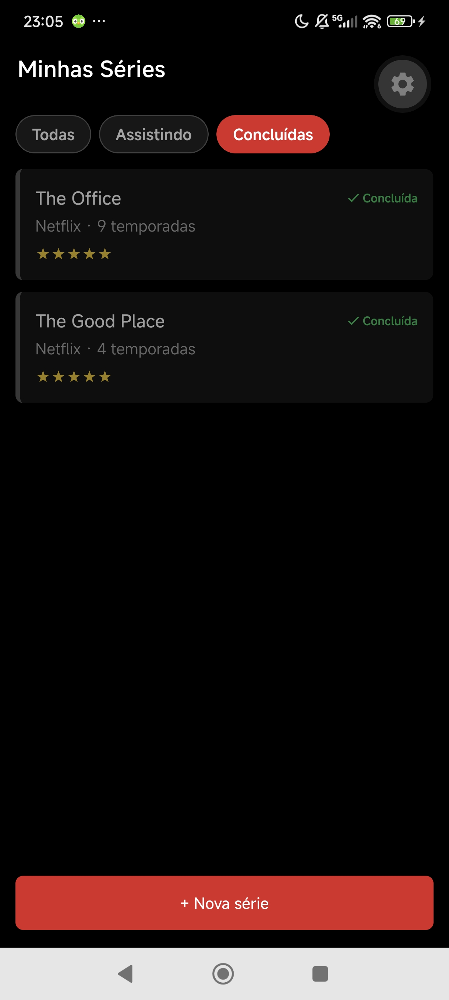
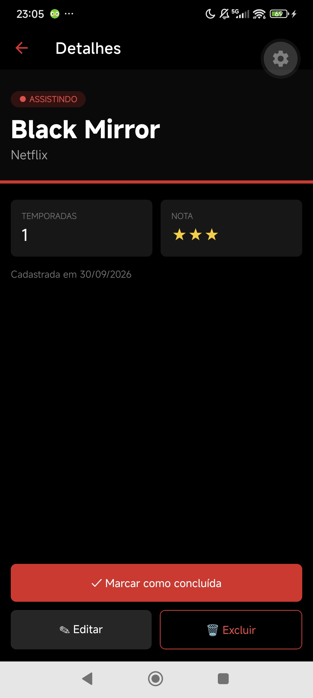
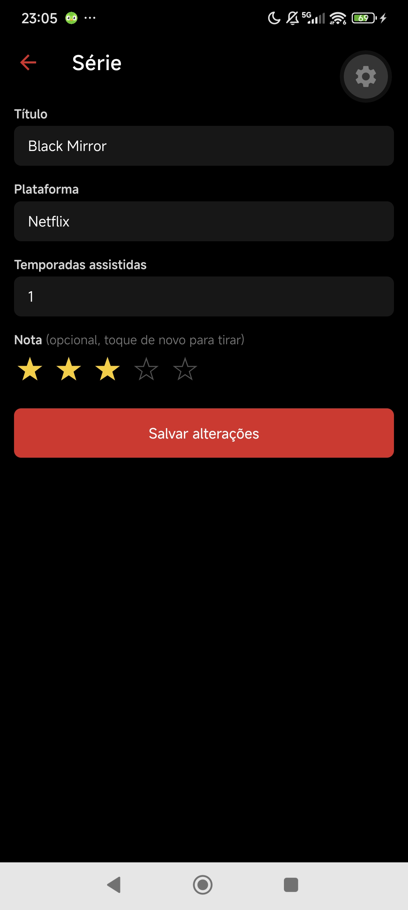
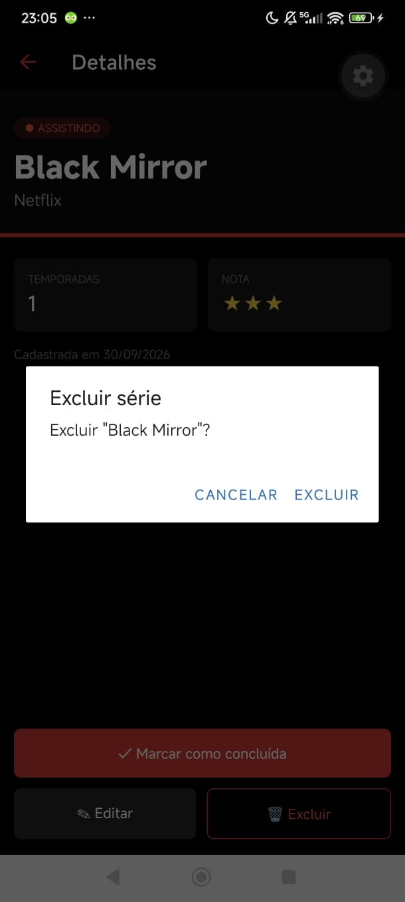
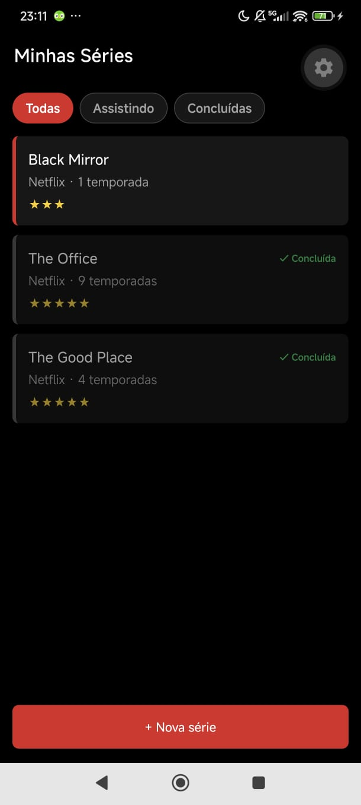

# Minhas Séries 🎬

App mobile para registrar as séries que eu assisti ou estou assistindo. Dá para cadastrar uma série com plataforma, temporadas assistidas e nota de 1 a 5, filtrar entre **todas**, **assistindo** e **concluídas**, marcar como concluída, editar e excluir. Os dados ficam salvos no celular com SQLite e continuam lá depois de fechar o app.

Projeto prático da disciplina, feito com a IA como copiloto.

## Tecnologias

- [Expo](https://expo.dev) (SDK 57) + React Native + TypeScript
- [Expo Router](https://docs.expo.dev/router/introduction/): 3 telas em pilha (`Stack`) com passagem de parâmetro (`?id=`)
- [NativeWind 4](https://www.nativewind.dev) (Tailwind CSS no React Native)
- [expo-sqlite](https://docs.expo.dev/versions/latest/sdk/sqlite/) com Repository Pattern

## Como rodar

```bash
npm install
npx expo start
```

Depois é só escanear o QR code com o app **Expo Go** no celular.

## Estrutura

```
app/
├── _layout.tsx        # Stack com as 3 rotas + roda as migrations ao abrir o app
├── index.tsx          # Lista com filtros (todas / assistindo / concluídas)
├── form.tsx           # Cadastro (/form) e edição (/form?id=3) na mesma tela
└── detalhe.tsx        # Detalhe: concluir, editar e excluir
src/
├── types/serie.ts              # Serie, CreateSerieInput, UpdateSerieInput, SerieFilter
└── database/
    ├── database.ts             # Conexão (singleton) e criação da tabela
    └── serieRepository.ts      # As 6 funções de acesso ao banco (todas com "?")
```

As telas nunca escrevem SQL: elas chamam o repositório, que chama a conexão.

## Telas

| Lista vazia | Cadastro (com dicas nos campos) | Lista com 3 séries |
| :-: | :-: | :-: |
|  |  |  |

| Filtro "Assistindo" | Filtro "Concluídas" | Detalhe |
| :-: | :-: | :-: |
|  |  |  |

| Edição (mesmo formulário, já preenchido) | Confirmação de exclusão |
| :-: | :-: |
|  |  |

## Teste de persistência

1. Cadastrei 3 séries: *Black Mirror*, *The Office* e *The Good Place*.
2. Concluí *The Office* e *The Good Place* e editei *Black Mirror*.
3. **Fechei o app completamente** (removi da lista de apps recentes) e abri de novo.

| Antes de fechar (23:05) | Depois de fechar e reabrir (23:11) |
| :-: | :-: |
|  |  |

Depois de reabrir, as 3 séries continuaram lá, com o status, a nota e a edição salvos, e os filtros "Assistindo" e "Concluídas" seguiram funcionando (prints 4 e 5 acima). Os dados estão no SQLite do celular, não na memória do app.

## Diário do copiloto

### Registro 1 — Etapa 1
**O que eu pedi:** o `npx expo install expo-sqlite react-native-reanimated react-native-worklets` deu `npm error ERESOLVE` e perguntei se tinha dado erro ou se dava pra seguir.

**O que a IA sugeriu (resumo):** explicou que o npm tentou puxar o `react-dom@19.3.0` (dependência opcional, só para web), que exige `react@19.3`, enquanto o Expo 57 usa `react@19.2.3`. Sugeriu repetir o comando passando a flag para o npm: `npx expo install ... -- --legacy-peer-deps`.

**O que eu fiz:** aceitei. Continuei usando `npx expo install` (como pede a aula), só repassando a flag para o npm, igual o enunciado já faz na instalação do NativeWind.

### Registro 2 — Etapa 1
**O que eu pedi:** como configurar o Expo Router e onde criar as telas.

**O que a IA sugeriu (resumo):** o `AGENTS.md` que veio no template do Expo 57 (instruções escritas para IAs) manda colocar as rotas em `src/app/`.

**O que eu fiz:** rejeitei. O enunciado e a rubrica (critério 1) pedem a pasta `app/` na raiz, com `src/` só para `types` e `database`, como em aula. Mantive `app/_layout.tsx` e `app/index.tsx` na raiz.

### Registro 3 — Etapa 1
**O que eu pedi:** ajuda para configurar o NativeWind (eu tinha perdido a Aula 2).

**O que a IA sugeriu (resumo):** criou os 5 arquivos (`tailwind.config.js`, `global.css`, `babel.config.js`, `metro.config.js`, `nativewind-env.d.ts`) e a tela "Configuração OK". Ao testar, apareceram 2 erros que não existiam no material da aula, porque meu projeto usa versões mais novas:

- `Cannot find module 'babel-preset-expo'`: o npm deixou o pacote "escondido" dentro de `node_modules/expo/`. Solução: `npx expo install babel-preset-expo -- --legacy-peer-deps`.
- `TS2882` no `import '../global.css'`: o TypeScript 6 passou a exigir declaração para imports de arquivos `.css`. Solução: `declare module '*.css';` no `nativewind-env.d.ts`.

**O que eu fiz:** aceitei depois de entender o motivo de cada erro. Aprendi que o `content` do `tailwind.config.js` precisa incluir `./app/**` senão os `className` são ignorados.

### Registro 4 — Etapa 2
**O que eu pedi:** explicação do que eram `Serie`, `CreateSerieInput`, `UpdateSerieInput` e `SerieFilter` (eu não sabia o que era um "tipo").

**O que a IA sugeriu (resumo):** explicou com um exemplo de outro domínio (`Livro`), sem me dar o arquivo pronto: o que é um `type`, o `Omit` para "tirar" campos, o union type (`'a' | 'b'`) e o `number | null` para a nota. Alertou que `concluida` deve ser `number` (0/1), nunca `boolean`, e que não pode ter `any`.

**O que eu fiz:** adaptei. Escrevi o `src/types/serie.ts` e pedi revisão. Usei `Omit` no `CreateSerieInput` e `Pick` no `UpdateSerieInput` (lista só os campos que o formulário edita: título, plataforma, temporadas e nota). A IA confirmou os tipos e o `npx tsc --noEmit` passou sem erros.

### Registro 5 — Etapa 3
**O que eu pedi:** o `database.ts` foi gerado pela IA (em outra conversa). Pedi para conferir se estava certo e para explicar o que era o `runMigrations`.

**O que a IA sugeriu (resumo):** explicou que migration é a função que "monta a estrutura" do banco (cria a tabela) e roda toda vez que o app abre; o `IF NOT EXISTS` evita recriar a tabela e apagar os dados. Explicou o singleton (`getDatabase` guarda a conexão e abre o banco uma vez só). Apontou que o `runMigrations` já existia, mas não era chamado em lugar nenhum, e sugeriu chamá-lo no `app/_layout.tsx` com `useEffect` + um estado `pronto`, para as telas só aparecerem depois que a tabela existir.

**O que eu fiz:** aceitei. Coloquei a chamada no `_layout.tsx`. Entendi que, sem o `pronto`, a lista (Etapa 5) poderia tentar ler a tabela antes de ela ser criada. O `tsc` passou e o app abriu sem erro.

### Registro 6 — Etapa 4
**O que eu pedi:** revisão do `serieRepository.ts` que eu escrevi, antes do commit.

**O que a IA sugeriu (resumo):** confirmou as 6 funções, o `?` em todos os valores, o filtro no `WHERE` e o retorno com `lastInsertRowId`. Apontou um risco: eu montava as queries juntando constantes com template string (`` `${SELECT_SERIES} WHERE id = ?` ``). Era seguro, porque as constantes eram texto fixo e os valores entravam com `?`, mas a rubrica diz que *qualquer* query montada com interpolação zera o critério.

**O que eu fiz:** corrigi. Escrevi as queries do `getSeries` e do `getSerieById` por extenso (`'SELECT * FROM series WHERE id = ?'`) e apaguei as constantes. Não sobrou nenhum `${` no arquivo.

### Registro 7 — Etapa 5 (Parte 3: `useFocusEffect`)
**O que eu pedi:** explicação do `useFocusEffect` e do `useCallback` que eu usei na lista.

**O que a IA sugeriu (resumo):** no Stack, quando vou para o `/form`, a lista não é desmontada: fica "embaixo" na pilha. Ao voltar, ela não é montada de novo, então um `useEffect(..., [])` não roda outra vez e a série nova não aparece. O `useFocusEffect` roda toda vez que a tela ganha foco. Ele pede `useCallback` porque, sem isso, a função seria recriada a cada renderização; o hook acharia que é uma função nova e rodaria de novo à toa. Com `useCallback(..., [filtro])`, a função só muda quando o filtro muda, e aí a lista recarrega com o filtro novo.

**O que eu fiz:** aceitei. Mantive o `useFocusEffect` com `useCallback` e `[filtro]` como dependência. Isso também resolve o recarregamento ao trocar de filtro, sem precisar de outro `useEffect`.

### Registro 8 — Etapa 5
**O que eu pedi:** um visual preto e vermelho, estilo Netflix, para a lista.

**O que a IA sugeriu (resumo):** trocou os `Button` por `Pressable` (o `Button` não aceita `className`), deixou o filtro ativo em vermelho, montou o card com título, plataforma, temporadas e nota em estrelas (ou "Sem nota" quando é `null`), e deixou as concluídas apagadas (`opacity-60`) com o selo "✓ Concluída". O cabeçalho do Stack ficou preto pelo `screenOptions` do `_layout`.

**O que eu fiz:** aceitei. Entendi que `item.nota === null` precisa ser tratado antes de renderizar, senão o TypeScript reclama e a tela mostraria nada no lugar da nota.

### Registro 9 — Etapa 6
**O que eu pedi:** um passo a passo da Etapa 6 (sem o arquivo pronto) e, depois, revisão do `app/form.tsx` que eu montei.

**O que a IA sugeriu (resumo):** dividiu a tela em 8 passos: ler o `id` com `useLocalSearchParams` (chega como `string`, converter com `Number(id)`), guardar `temporadas` como texto e converter só ao salvar, estrelas com `setNota(nota === n ? null : n)`, `useEffect` para carregar a série na edição e validação com `Alert.alert` antes de chamar `createSerie`/`updateSerie`. Na revisão, apontou que `2.5` passava na validação de temporadas e sugeriu `Number.isInteger`.

**O que eu fiz:** segui o passo a passo e escrevi a tela. Na revisão, aceitei trocar `Number.isNaN(temps)` por `!Number.isInteger(temps)`, porque temporada é um número inteiro e a coluna no banco é `INTEGER`.

### Registro 10 — Etapa 7
**O que eu pedi:** um passo a passo da tela de detalhe e onde eu podia usar IA nela. Escrevi a lógica (carregar, concluir, editar e excluir) e pedi para a IA melhorar só o visual (mostrar os dados e os botões).

**O que a IA sugeriu (resumo):** no roteiro, alertou que o detalhe também precisa de `useFocusEffect`: ao voltar do `/form` depois de editar, a tela estava "embaixo" na pilha e mostraria o título antigo com `useEffect`. Explicou o 3º parâmetro do `Alert.alert` (lista de botões, com "Cancelar" e "Excluir") para confirmar a exclusão. Na revisão, apontou que eu só mostrava o status quando a série estava concluída e refez o visual: capa com selo "Assistindo"/"Concluída", cartões de temporadas e nota, e os botões presos no rodapé acima da barra do Android.

**O que eu fiz:** escrevi toda a lógica da tela seguindo o roteiro; aceitei o visual da IA. Testei que, depois de editar, o detalhe já mostra os dados novos.

### Registro 11 — Etapa 6
**O que eu pedi:** o botão "+ Nova série" ficava escondido atrás da barra de navegação do Android (voltar, home e recentes).

**O que a IA sugeriu (resumo):** usar o `useSafeAreaInsets` (da `react-native-safe-area-context`, já instalada com o Router) para saber a altura dessa barra, que muda de aparelho para aparelho, e posicionar o botão com `style={{ bottom: insets.bottom + 16 }}`. Como o valor é calculado na hora, ele não dá para ser uma classe fixa do NativeWind (`bottom-6`).

**O que eu fiz:** aceitei. É o único lugar em que uso `style` junto com `className`, e o motivo é esse valor dinâmico. Usei a mesma ideia nos botões da tela de detalhe.

